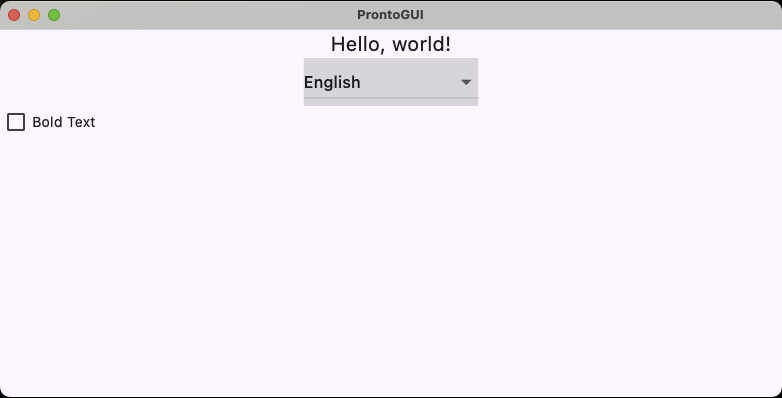

## Introduction
ProntoGUI is a tool for quickly building a Graphical User Interfaces (GUIs) for services or programs written in Go.

ProntoGUI has two primary pieces:  a lightweight library and a rendering App.  The library, called Golib, provides a data model for composing the GUI and a layer for communicating with the App.  The App is a native application written in Flutter which can be built for Windows, Linux, or Mac OS.  It functions like a web browser by rendering the GUI experience to the user and handling user input.  The library and the App communicate using industry standard gRPC protocol over an HTTP/2 connection.  

### A Brief History of User Interfaces

Since the dawn of modern computing, circa late 1960's, developers have relied on command-line user interfaces.  Just about every programming language supports these, and practically every operating system has a graphical shell to interact with standard input/output streams.  Over time, standards were developed such as ANSI VT100 that allow special escape sequences to represent colors, font styles, flashing text, commands to erase the screen, track cursor position, and much more.  Large and complex applications were developed this way for just about everything, including Enterprise Resource Planning (ERP), stock trading systems, bulletin board systems (BBS), and word processing.

This was a joyful time to be a developer because you could build an entire application end-to-end without leaving the COBAL, C/C++, BASIC, or whatever environment you worked in.  Stuff got done faster because there were fewer communications paths between business analysts and the roles needed to build and support the application.  Consequently, more responsibility rested on the developer to build a reliable and maintainable solution.

The beginnings of GUI technology were invented at Xerox PARC in the early 70's but it wasn't until the mid 80's to early 90's that it became mainstream, with the introduction of Microsoft Windows 3.0, Apple Macintosh computer, and the X Window System for Unix.  Although developing a GIU took more work and skill, it was tenable since it could be done in a single programming environment, commonly C or C++ with an API such as Win32, Carbon, or X Windows.  Ports of GUI APIs were made for other popular languages such as Pascal and BASIC.

Around the same time, computer networking became more affordable, and businesses started connecting all their computers to share resources, such as file storage, database storage, and printing.  Businesses switched to building solutions into two pieces now, consisting of a client/user GUI along with a server-oriented software package, and the term "client-server architecture" became popular.  This approach made way for division of labor when building solutions and allowed multiple users to access a central, shared information resource.  At this point in history, a schism started in software development.  New roles were created for building and maintaining server-side software and for creating GUIs that people like to use.

These roles eventually expanded further to include back-end developer, front-end developer, App developer, User Interface (UI) developer, User eXperience (UX) designer, HTML coder, and Javascript developer, to name a few.  A myriad of programming languages and frameworks have been created specifically for these various roles.  

### The Problem with GUI Development Today

These days, a GUI is developed using an immediate-mode library, a native application, or a web-based application.  Each approach has tradeoffs and ideal use cases.  The one thing they have in common is a large learning curve to become proficient at developing applications.  It is unusual for developers to be equally proficient at building back-end software using environments like Go, Python, C++, and Rust, while simultaneously building Apps using React.js, React Native, C#/.NET, Qt, etc.

Immediate-mode libraries, such as Qt, Gnome, or Windows Forms, render a GUI in the same process environment where the software runs.  In some cases, this isn't practical because the software is running in a headless scenario.  In this case, a GUI is developed as a traditional application in a separate project altogether using tools like React.js.  A networking connection provides a communication bridge to the back-end software.

Native applications can provide the highest level of usability and features specific to the operating system.  However, they tend to be hard to port across operating systems, unless you use a tool like Flutter or React Native. 

Web-based applications have a high degree of portability and can be run on most browsers.  These are often developed using Javascript along with a framework like Vue.js, Angular.js, or React.js.  The learning curve is steep and there are lots of moving parts to keep track of.  The Software Bill of Materials (SBOM) for these applications can involve hundreds to thousands of packages, each with ongoing version updates and cybersecurity concerns.  The applications tend to exhibit nuances on different browser products or versions, so developers often package and deliver their solutions with a known browser environment using tools such as Electron.js or Tauri.

### Why I Developed ProntoGUI
A few years ago, I was developing computer simulations of machines in a manufacturing environment.  I chose to use Go because of it's simplicity the ease of multithreading.  When I looked around for GUI libraries, many were outdated, under-featured, or produced GUIs that looked out of place.  I ended up settling on one.  While it was good enough at the time, it lacked some basic features like changing text fonts.  In the meantime, I watched a few colleagues spend months mastering React.js.  The GUIs they developed looked nice, but took them weeks to build modest applications as they encountered many obstacles to deploying them.  

Thinking back to a long time ago, I used a software called Visual Basic to build a Windows application for commissioning and programing machines that my company made.  Visual Basic was a wonderful tool at the time and was easy to learn.  One could build GUI applications quickly using a visual designer, write code in BASIC for everything else, and easily deploy to Windows-based computers.  

Since building the simulation software, I set out on a mission to develop a better way to build GUIs in Go, and eventually other languages, that brings back the joy I found using Visual Basic.  My mission would consist of three major goals.  First, define a standard "data model" to build GUIs that is simple to use, lightweight, easy to maintain as demands increase for more GUI features, and could be applied to any modern programming language.  Second, develop an open-source rendering App that can work on all major platforms, including mobile.  Lastly, develop a visual designer that brings back the joy of Visual Basic to customize how GUIs are rendered.

As of now, parts 1 and 2 of my mission are ready to use.  Part 3 is currently in the planning stages.

## The Golib Library
The library is a Go module that can be imported from https://github.com/prontogui/golib using Go's package management system.  It provides a data objects called "primitives" that are used to build a GUI while providing access to state changes during user interaction. It also provides communication services necessary for connecting with the App.

You can think of primitives as objects describing what you intend to show on the screen.  They are represented in Go as simple structs containing "fields", which you read or write throughout the operation of the GUI.  For example, the Command primitive has a field called Label that represents the text to display on a command button.  When you set this field, the GUI will automatically reflect this change via the communication that occurs with the app.  This approach provides a more natural way to reason about what the GUI should do and avoids expansive APIs and procedural thinking.

Some primitives act as "containers" that hold other primitives.  For example, the List primitive is used to show scrollable content on the screen.  It holds a 1-dimensional array of primitives to display.

By design, primitives omit fine-grained details like screen positioning, layout, colors, fonts, and so on.  The goal is to describe the structural elements of what's shown on the screen from the back-end developer's perspective.

To specify the look, feel, and behavior or primitives, there are JSON data structures called "embodiments" that describe the shape each structural element takes on.  The back-end developer can configure embodiments directly in code.

The primitives available in the library are:

### Check
A check provides a yes/no, on/off, 1/0, kind of choice to the user.  It is often represented with a check box like you would see on a form.


### Choice
A choice is a user selection from a set of choices.  It is often represented using a pull-down list.

#### *Example - Closed*


#### *Example - Expanded*


### Command
A command is used to handle momentary requests by the user such that, when the command is issued, the service does something useful.  It is often rendered as a button with clear boundaries that suggest it can be clicked.

#### *Example*


### Export File
A file represents a blob of data that can be exported from the server side and stored to a file on the app side.  The perspective of "export" is centered around the server software.  This seems to be a little clearer than using Download/Upload terminology.

#### *Example*

A command button appears for selecting a file, in which the exported data will be stored in on the App side.


Clicking the button opens a native dialog window for choosing where to save the file.


### Frame
A frame represents a complete user interface to show on the screen.  It could be the main user interface or a sub-screen in the app

#### *Example - Simple*


#### *Example - Snackbar*


### Group
A group is a related set of primitives, such as a group of commands, that is static in type and quantity.  If a dynamic number of primitives is desired, then consider using a List primitive instead. 

#### *Example*

Group primitives are used to layout primitives horizontally or vertically.


### Import File
A file represents a blob of data that can be imported from the app side and consumed on the server side.

#### *Example*

A command button appears for selecting a file.


Clicking the button opens a native dialog for choosing the file.


### List
A list is a collection of primitives that have a sequential-like relationship and might be dynamic in quantity or kind.  

#### *Example - Simple*


#### *Example - Cards*

Group primitives are used a list items to display "cards" in Material 3 fashion.


### Table
A table displays an array of primitives in a grid of rows and columns.  

#### *Example*


### Text
A text primitive displays text on the screen.


### TextField
A text field allows the user to enter text.

#### *Example*


### Timer
A timer is an invisible primitive that fires an event, triggering an update to the server.  This is useful for low-precision GUI updates that originate on the server side.  An example is updating "live" readings from a running process on the server.

### Tristate
A choice presented to the user that give three possible states:  Affirmative (Yes, On, 1, etc.), Negative (No, Off, 0, etc.), and Indeterminate.

#### *Examples*


## The App
The Application or "App" is used to render a GUI and provide interaction with the mouse, keyboard, and touchscreen (if available).  It is based on Flutter, an open-source UI kit created by Google.  The App can be compiled for various platforms including macOS, Windows, Linux, iOS, Android, and Web.

The App connects to your program using gRPC through an endpoint you specify.  Communication is handled behind the scenes by the Golib library and App.

The source code for the App can be cloned from https://github.com/prontogui/app.

## Tutorial

The following tutorial will walk you through building an international capable "Hello World" Go program.  Along the way, you will see how to build the App for a desktop environment, how to use primitives, and how to handle events coming from the App.

This tutorial assumes a basic understanding of programming in Go, including:  creating and initializing a new Go project using ```go mod init```, importing modules, and the structure of a main.go program.

### Building the App
The App was developed using the Flutter framework by Google and the Dart programming language.  You must install Flutter and its associated tools to build the desktop App for your particular operating system.  Instructions for this can be found on the Flutter website at https://docs.flutter.dev/get-started.  Flutter currently supports macOS, Windows, and Linux desktops.

### Hello World - International Version
The program we'll create is a variation of the "hello world" program.  Taking a step further, it will have the ability to customize the text for different languages and styling.  

As of this writing, we are targeting Go version 1.22.1

#### STEP 1 - Create Project

Create a new Go project from the command line:

```
mkdir tutorial
cd tutorial
go mod init tutorial/hello

```

Add the Golib module to the go.mod file.

```
module tutorial/hello

go 1.22.1

require github.com/prontogui/golib v0.0.53
```

#### STEP 2 - Hello World, Version 0
Add the following code to the main program:

```Go
package main

import (
	"fmt"

	// Import the Go library for ProntoGUI
	pg "github.com/prontogui/golib"
)

func main() {

	// Initialize ProntoGUI
	pgui := pg.NewProntoGUI()
	err := pgui.StartServing("127.0.0.1", 50053)

	if err != nil {
		fmt.Printf("Error trying to start server:  %s", err.Error())
		return
	}

	// Build the GUI using primitives

	helloText := pg.TextWith{
		Content:    "Hello, world!",
		Embodiment: "fontFamily:Roboto, fontSize:20.0",
	}.Make()

	pgui.SetGUI(helloText)

	for {
		// Wait for something to happen in the GUI
		_, err := pgui.Wait()
		if err != nil {
			fmt.Printf("error from Wait() is:  %s\n", err.Error())
			break
		}
	}
}
```

#### Notes About Building the GUI

Primitives are created in Go using a code block similar to:
```
somePrimitive := pg.{Primitive}With{
	Field1:  FieldAssignment1,
	Field2: FieldAssignment2,
	.
	.
	.
}.Make()
```

For example, to create a Command primitive:
```Go
someCmd := pg.CommandWith{
	Label: "Press Me",
	Embodiment: "outlined-button",
	Status: 1
}.Make()
```

This method of construction specifies the initial field values for a new primitive and "makes" (creates) the primitive.  The ```Make()``` method operates on the struct literal and returns a reference to an internal object representing the primitive.  The internal object provides field accessors, such as ```Label() string``` & ```SetLabel(string content) Command``` to read and write fields.

An alternative approach is use New{Primitive} functions with inline field settings.  For example:
```Go
someCmd := pg.NewCommand("Press Me").SetEmbodiment("outlined-button").SetStatus(1)
```

Once all the primitives are created for the complete GUI, then a call is made to ```pgui.SetGUI()``` with a list of top-level primitives.  These primitives, along with their child primitives, and so on, represent a heirarchy of GUI items that will be rendered at the first call to ```pgui.Wait()```.

Run go mod tidy:
```
go mod tidy
```

At this point, you can test the program by running it.

```
go run .
2024/08/19 19:38:36 INFO server is now listening address=127.0.0.1:50053
```

Launch the app from a separate terminal session:
```
cd {App source code folder}
flutter run
```

Next, you will be asked to select the platform.  If running on a Mac, you'll see something like:
```
macOS (desktop)                 • macos                 • darwin-arm64   • macOS 14.5 23F79 darwin-arm64
Mac Designed for iPad (desktop) • mac-designed-for-ipad • darwin         • macOS 14.5 23F79 darwin-arm64
Chrome (web)                    • chrome                • web-javascript • Google Chrome 127.0.6533.120

No wireless devices were found.

[1]: macOS (macos)
[2]: Mac Designed for iPad (mac-designed-for-ipad)
[3]: Chrome (chrome)
Please choose one (or "q" to quit): 
```

Choose [1] for macOS (or the desktop OS you are running).

After a few moments and the App is compiled, you will see the GUI:


Terminate the program.  You can keep the App alive since it will wait for the connection to reappear.

#### STEP 3 - Hello World, Version 1

Now we are going to add a choice primitive to select the language for displaying the message.  Add the following code to the ```main()``` function as indicated by the comments:

```Go
func main() {

	// Initialize ProntoGUI
	pgui := pg.NewProntoGUI()
	err := pgui.StartServing("127.0.0.1", 50053)

	if err != nil {
		fmt.Printf("Error trying to start server:  %s", err.Error())
		return
	}

	// Build the GUI using primitives

	normalTextEmbodiment := "fontSize:20.0"

	helloText := pg.TextWith{
		Content:    "Hello, world!",
		Embodiment: normalTextEmbodiment,
	}.Make()

	// +++ ADD THIS CODE BLOCK
	languageChoice := pg.ChoiceWith{
		Choices: []string{"English", "Japanese / 日本語", "German / Deutsche", "Russian / Русский"},
		Choice:  "English",
	}.Make()

	pgui.SetGUI(helloText, languageChoicek)

	for {
		// Wait for something to happen in the GUI
		_, err := pgui.Wait()
		if err != nil {
			fmt.Printf("error from Wait() is:  %s\n", err.Error())
			break
		}

		// Update fields of primitives based on user interactions

		// Set the content of Hello, World based on user selected language choice
		switch languageChoice.Choice() {
		case "English":
			helloText.SetContent("Hello, world!")
		case "Japanese / 日本語":
			helloText.SetContent("こんにちは世界！")
		case "German / Deutsche":
			helloText.SetContent("Hallo Welt!")
		case "Russian / Русский":
			helloText.SetContent("Привет, мир!")
		}
	}
}

```
Please note:  all language translation was done using Google translate.

Run the program again.  You will see the choice pull-down to select the language.


When you select a different language, the message is updated immediately.

#### STEP 4 - Hello World, Final Version 2
As a final step, let's add a checkbox to make the Hello, World appear in **bold**.  Add the following code to the ```main()``` function as indicated by the comments:

```Go
func main() {

	// Initialize ProntoGUI
	pgui := pg.NewProntoGUI()
	err := pgui.StartServing("127.0.0.1", 50053)

	if err != nil {
		fmt.Printf("Error trying to start server:  %s", err.Error())
		return
	}

	// Build the GUI using primitives

	// +++ ADD THIS LINE
	boldTextEmbodiment := "fontSize:20.0, fontWeight:bold"
	normalTextEmbodiment := "fontSize: 20.0"

	helloText := pg.TextWith{
		Content:    "Hello, world!",
		Embodiment: normalTextEmbodiment,
	}.Make()

	languageChoice := pg.ChoiceWith{
		Choices: []string{"English", "Japanese / 日本語", "German / Deutsche", "Russian / Русский"},
		Choice:  "English",
	}.Make()

	// +++ ADD THIS LINE
	boldCheck := pg.CheckWith{Label: "Bold Text"}.Make()

	// *** MODIFY THIS LINE
	pgui.SetGUI(helloText, languageChoice, boldCheck)

	for {
		// Wait for something to happen in the GUI
		_, err := pgui.Wait()
		if err != nil {
			fmt.Printf("error from Wait() is:  %s\n", err.Error())
			break
		}

		// Update fields of primitives based on user interactions

		// Set the content of Hello, World based on user selected language choice
		switch languageChoice.Choice() {
		case "English":
			helloText.SetContent("Hello, world!")
		case "Japanese / 日本語":
			helloText.SetContent("こんにちは世界！")
		case "German / Deutsche":
			helloText.SetContent("Hallo Welt!")
		case "Russian / Русский":
			helloText.SetContent("Привет, мир!")
		}

		// +++ ADD THIS CODE BLOCK
		// Make the text bold or normal based on user selection
		if boldCheck.Checked() {
			helloText.SetEmbodiment(boldTextEmbodiment)
		} else {
			helloText.SetEmbodiment(normalTextEmbodiment)
		}
	}
}
```
Run the program again.  You will see the checkbox for selecting bold text.



### Tutorial Summary

The basic structure for writing a GUI is:

1.  Initialize ProntoGUI and start the server
1.  Build the GUI using primitives, while keeping references to primitives you want to modify throughout operation of the GUI.
1.  Construct a loop that waits for interactions in the GUI, updates the state of primitives based on new input, then goes back to waiting.

GUIs are built using primitive objects, which work just like data structures.  These objects are created using a technique using struct literals, followed by a ```Make()``` function call, to initialize optional fields ahead of time.  Once created, these primitive objects have fields that you modify in your program to respond to user interactions and to reflect new state.  

## Where to Go Next

The following repositories provide additional examples of using ProntoGUI:

* https://github.com/prontogui/goexamples - various examples of using each kind of primitive in the Go language.
* https://github.com/prontogui/gc2024demo - demo program that Andy developed for his lightning talk at GopherCon 2024 titled "Do you want a GUI with that?"
* https://github.com/prontogui/gotutorial - the complete source code for this tutorial.

You may also reach out to info@prontogui.com with questions or feedback on this project.
